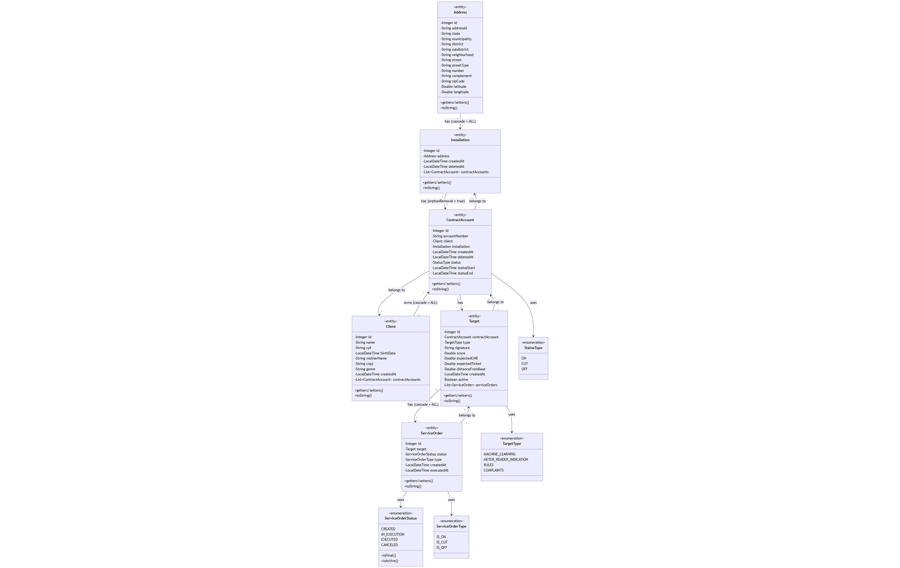

# Field Installation Management System (FIMS)


> A production-ready REST API for managing field inspection operations, service orders, and customer installations with enterprise-grade authentication, monitoring, and analytics capabilities.

## Documentation

- **[API Documentation (Swagger UI)](https://maikereis.github.io/fims/swagger.html)** - Interactive API explorer
- **[JavaDoc Documentation](https://maikereis.github.io/fims/javadoc/index.html)** - Comprehensive code documentation
- **[Postman Collection](FIMS%20API%20Test%20Suite.postman_collection.json)** - Complete API test suite

---

## Overview

FIMS (Field Installation Management System) is an enterprise-grade Spring Boot application designed to centralize and streamline field inspection operations. The platform provides a unified interface for managing the complete lifecycle of field operations, from target identification to service order execution.

### Core Capabilities

**Customer & Location Management**
- Client records with CPF/CNPJ validation
- Geocoded address management with coordinate support
- Installation tracking and lifecycle management

**Contract & Service Operations**
- Contract account management with status tracking
- Inspection target generation from multiple sources (ML, rules, complaints)
- Service order creation, assignment, and execution tracking

**Security & Observability**
- JWT-based authentication with role-based access control
- Comprehensive monitoring via Prometheus and Grafana
- Health checks and metrics for all service components

### Key Features

- Complete CRUD operations for all domain entities
- JWT authentication with role-based authorization
- Custom validation annotations for domain-specific rules
- Comprehensive error handling with structured exception responses
- Real-time monitoring and metrics via Spring Actuator
- Containerized deployment with Docker Compose
- RESTful API design following industry best practices
- Extensive test coverage with automated test suite

---

## Motivation

In field operations such as utilities management, infrastructure audits, safety inspections, or environmental monitoring, organizations face significant challenges in coordinating inspections and maintaining traceability between objectives, tasks, and executed work.

FIMS addresses these challenges by providing a robust backend service that enables:

- **Centralized Target Management**: Register and monitor inspection targets from diverse sources including machine learning models, business rules, and customer complaints

- **Complete Traceability**: Maintain full audit trails linking targets to generated inspections and service orders

- **Operational Visibility**: Track work order status and field inspection progress in real-time

- **Strategic Decision Support**: Provide structured, integrated views of field operations to facilitate data-driven decision-making and strategic planning

---

## Architecture

### Domain Model



### Technology Stack

| Layer | Technology |
|-------|-----------|
| **Backend Framework** | Spring Boot 3.5.6, Java 21 |
| **Security** | Spring Security, JWT (jjwt 0.12.6) |
| **Persistence** | PostgreSQL 16, Spring Data JPA |
| **Validation** | Jakarta Validation, Custom Validators |
| **Monitoring** | Prometheus, Grafana, Spring Actuator |
| **API Documentation** | SpringDoc OpenAPI 3 |
| **Build Tool** | Maven 3.9+ |
| **Containerization** | Docker, Docker Compose |

---

## Getting Started

### Prerequisites

- **Java Development Kit 21+** - [Download OpenJDK](https://adoptium.net/)
- **Docker & Docker Compose** - [Install Docker](https://docs.docker.com/get-docker/)
- **Apache Maven 3.9+** (optional, wrapper included)

### Docker Compose Deployment (Recommended)

```bash
# Clone the repository
git clone https://github.com/maikereis/fims.git
cd fims

# Configure environment variables
cp .env.example .env
# Edit .env with your configuration

# Start all services
docker-compose up -d

# Verify service health
docker-compose ps
```

**Service Endpoints:**

| Service             | Description                                | URL                                                                            |
| ------------------- | ------------------------------------------ | ------------------------------------------------------------------------------ |
| **Application API** | Main backend API (requires authentication) | [http://localhost:8080](http://localhost:8080)                                 |
| **Swagger UI**      | API documentation & testing interface      | [http://localhost:8080/swagger-ui.html](http://localhost:8080/swagger-ui.html) |
| **pgAdmin**         | PostgreSQL administration dashboard        | [http://localhost:5050](http://localhost:5050)                                 |
| **Grafana**         | Metrics visualization and dashboards       | [http://localhost:3000](http://localhost:3000)                                 |
| **Prometheus**      | Metrics scraping and monitoring            | [http://localhost:9090](http://localhost:9090)                                 |
| **Node Exporter**   | Host system metrics                        | [http://localhost:9100](http://localhost:9100)                                 |


### Local Development

```bash
# Build the project
./mvnw clean install

# Run with development profile (H2 in-memory database)
./mvnw spring-boot:run -Dspring-boot.run.profiles=dev

# Run with production profile (PostgreSQL)
./mvnw spring-boot:run -Dspring-boot.run.profiles=prod
```

---

## Authentication

FIMS implements JWT (JSON Web Token) authentication with role-based access control for secure API access.

### Default Administrative Credentials

```
Username: administrator
Password: password
```

**Note:** Change these credentials immediately in production environments.

### Authentication Workflow

**Step 1: Obtain JWT Token**
```bash
curl -X POST http://localhost:8080/api/auth/login \
  -H "Content-Type: application/json" \
  -d '{
    "username": "administrator",
    "password": "password"
  }'
```

**Step 2: Authenticate Subsequent Requests**
```bash
curl -X GET http://localhost:8080/api/clients \
  -H "Authorization: Bearer <your-jwt-token>"
```

### Role-Based Access Control

| Role | Access Level |
|------|-------------|
| `ROLE_USER` | Read-only access to standard endpoints |
| `ROLE_MODERATOR` | User permissions plus update operations |
| `ROLE_ADMIN` | Full system access including user management |

---

## API Reference

### Core Resources

| Resource | Endpoint | Description |
|----------|----------|-------------|
| **Authentication** | `/api/auth` | User authentication, registration, and session management |
| **Addresses** | `/api/addresses` | Physical location management with geocoding support |
| **Clients** | `/api/clients` | Customer information and profile management |
| **Installations** | `/api/installations` | Service installation point tracking |
| **Contract Accounts** | `/api/contract-accounts` | Service contract lifecycle management |
| **Targets** | `/api/targets` | Inspection target management (ML, rules, complaints) |
| **Service Orders** | `/api/service-orders` | Field work order creation and tracking |

### Example API Operations

**Create Client Record:**
```bash
curl -X POST http://localhost:8080/api/clients \
  -H "Authorization: Bearer ${TOKEN}" \
  -H "Content-Type: application/json" \
  -d '{
    "name": "João Silva",
    "cpf": "123.456.789-00",
    "birthDate": "1990-05-15T00:00:00",
    "motherName": "Maria Silva",
    "genre": "Masculino",
    "createdAt": "2025-01-10T10:00:00"
  }'
```

**Query Service Orders by Status:**
```bash
curl -X GET "http://localhost:8080/api/service-orders/status/CREATED" \
  -H "Authorization: Bearer ${TOKEN}"
```

**Filter Targets by Score Range:**
```bash
curl -X GET "http://localhost:8080/api/targets/score/between?min=0.8&max=1.0" \
  -H "Authorization: Bearer ${TOKEN}"
```

---

## Monitoring & Observability

### Health Check Endpoints

Each API module provides a health check endpoint accessible without authentication:

```bash
curl http://localhost:8080/api/addresses/check
curl http://localhost:8080/api/clients/check
curl http://localhost:8080/api/installations/check
```

### Actuator Metrics

Spring Boot Actuator exposes operational insights and metrics:

```bash
# Application health status
curl http://localhost:8080/actuator/health

# Prometheus-compatible metrics
curl http://localhost:8080/actuator/prometheus

# Application metadata
curl http://localhost:8080/actuator/info
```

### Grafana Monitoring

Pre-configured dashboards provide visibility into:
- HTTP request rates and response latency (p95, p99 percentiles)
- JVM memory utilization and garbage collection metrics
- Database connection pool statistics
- System resource utilization (CPU, memory)

**Dashboard Access:** http://localhost:3000 (admin/admin)

---

## Testing

### Automated Test Suite

Import the [Postman collection](FIMS%20API%20Test%20Suite.postman_collection.json) for comprehensive API testing:

- Authentication workflows (login, signup, token validation)
- Complete CRUD operations for all entities
- Advanced query operations (filtering, date ranges, status queries)
- Error handling and edge case scenarios
- Automated token management and request chaining

### Running Unit Tests

```bash
# Execute unit test suite
./mvnw test

# Generate coverage report
./mvnw verify

# View coverage report in browser
open target/site/jacoco/index.html
```

---

## Configuration

### Environment Variables

Create a `.env` file in the project root directory:

```bash
# Database Configuration
DB_NAME=fims_db
DB_USERNAME=fims_user
DB_PASSWORD=your_secure_password
DB_PORT=5432

# Application Configuration
SERVER_PORT=8080
CORS_ALLOWED_ORIGINS=http://localhost:3000,http://localhost:4200

# Administrative User
ADMIN_USER=administrator
ADMIN_EMAIL=admin@fims.com
ADMIN_PASSWORD=your_admin_password

# JWT Configuration
JWT_SECRET=your_base64_encoded_secret_key_at_least_256_bits
JWT_EXPIRATION=86400000

# Monitoring Services
GRAFANA_PASSWORD=admin
PGADMIN_EMAIL=admin@admin.com
PGADMIN_PASSWORD=admin
```

### Application Profiles

| Profile | Database | Purpose |
|---------|----------|---------|
| `doc` | H2 (in-memory) | GitHub Actions documentation generation |
| `dev` | H2 (in-memory) | Local development and testing |
| `prod` | PostgreSQL | Production deployment |
| `test` | H2 (in-memory) | Unit and integration testing |

**Activate Profile:**
```bash
./mvnw spring-boot:run -Dspring-boot.run.profiles=prod
```

---

## Project Structure

```
fims/
├── src/main/java/com/mqped/fims/
│   ├── config/              # Application configuration (Security, CORS, Database)
│   ├── controller/          # REST API endpoints
│   ├── exceptions/          # Custom exception hierarchy
│   ├── model/
│   │   ├── dto/            # Data Transfer Objects
│   │   ├── entity/         # JPA entity definitions
│   │   └── enums/          # Domain enumerations
│   ├── repository/         # Spring Data JPA repositories
│   ├── security/           # JWT utilities and security filters
│   ├── service/            # Business logic layer
│   ├── util/               # Utility classes
│   └── validation/         # Custom validation annotations
├── src/main/resources/
│   ├── application.yml         # Primary configuration
│   ├── application-dev.yml     # Development overrides
│   └── application-prod.yml    # Production overrides
├── monitoring/
│   ├── grafana/               # Dashboard definitions and provisioning
│   └── prometheus.yml         # Prometheus scrape configuration
├── Dockerfile                 # Container image definition
├── Compose.yaml              # Multi-container orchestration
└── pom.xml                   # Maven project descriptor
```

---

## Contributing

Contributions are welcome and appreciated. Please follow the standard Git workflow:

1. Fork the repository
2. Create a feature branch (`git checkout -b feature/enhancement-name`)
3. Commit your changes with clear, descriptive messages
4. Push to your fork (`git push origin feature/enhancement-name`)
5. Submit a Pull Request with a detailed description

### Development Standards

- Adhere to Java naming conventions and coding standards
- Document all public APIs with comprehensive JavaDoc
- Include unit tests for new features and bug fixes
- Maintain method complexity (aim for < 50 lines per method)
- Use descriptive, self-documenting variable and method names

---

## License

This project is licensed under the MIT License. See the [LICENSE](LICENSE) file for complete terms and conditions.

---

## Acknowledgments

- Spring Boot development team for the exceptional framework
- PostgreSQL community for a reliable, feature-rich database system
- Grafana Labs for powerful visualization and monitoring tools
- Open source contributors and project maintainers

---

## Support

- **Issue Tracking:** [GitHub Issues](https://github.com/maikereis/fims/issues)
- **Documentation:** [GitHub Pages](https://maikereis.github.io/fims/)
- **Email Contact:** maikerdralcantara@gmail.com

---

<div align="center">

**Built with Spring Boot and modern Java**

[Documentation](https://maikereis.github.io/fims/) • [API Reference](https://maikereis.github.io/fims/swagger.html) • [Report Issues](https://github.com/maikereis/fims/issues)

</div>